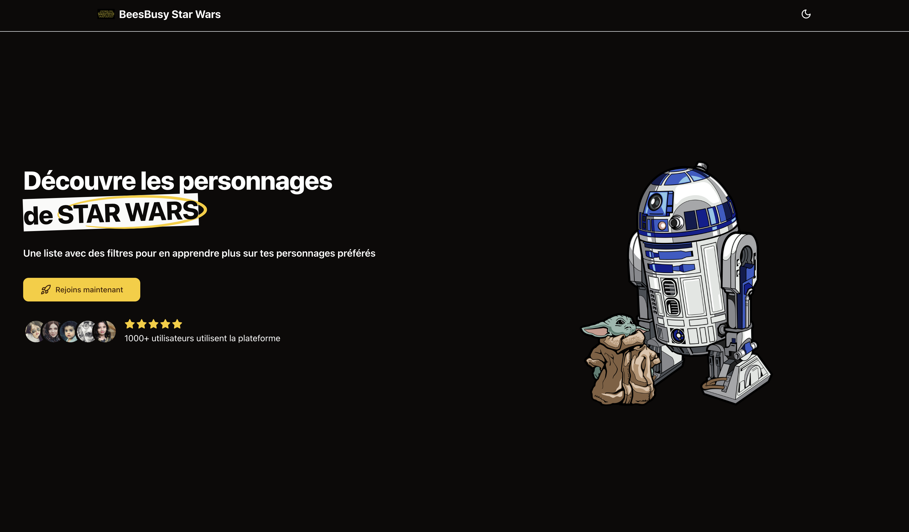

<br>
<p align="center">
  <a href="https://www.twenty.com">
    
  </a>
</p>

<h2 align="center" >Test technique Star Wars </h3>
<p align="center">Pour l'entreprise BeesBusy</p>

<p align="center"><a href="https://test-technique-star-wars.vercel.app/">🌐 Website</a><p>
<br />

<p align="center">
  <a href="https://www.twenty.com">
    <picture>
      
    </picture>
  </a>
</p>
<br>

<br>

# Démo

J'ai déployé l'application sur Vercel. C'est donc possible de tester via ce lien <a href="https://test-technique-star-wars.vercel.app/">test-technique-star-wars.vercel.app/</a>

<br>

# Énoncé

## Objectif

Le but est de créer une application Web "Personnages de Star Wars". L'application est composée d'une API déjà existante de recherche des personnages de la série de films couplée à une interface Web à développer pour la consultation de ces données.

## API

L’URL de l’API est https://swapi.py4e.com/api/people/

Sa documentation de trouve à la page : https://swapi.py4e.com/documentation#people

## Développement de l’application front Web

L’application doit proposer au minimum les fonctionnalités suivantes :

- Développer une interface utilisateur conviviale en utilisant React JS et ses Hooks.
- Privilégier l’utilisation de TypeScript tout en respectant les normes ES6.
- Lister les personnages des films Star Wars.
- Mettre en place un système de filtres, permettant de spécifier des critères comme le nom/prénom, la taille, le poids et le(s) film(s).
- Mettre en place un système de pagination si le nombre de personnage est important.
- Permettre la consultation du détail d'un personnage avec les informations suivantes :
  - Nom/prénom
  - Taille
  - Poids
  - Couleur des cheveux
  - Couleur des yeux
  - Genre
  - Films
  - Dates de création et de dernière modification au format JJ/MM/AAAA

Pouvoir naviguer du détail d’un personnage à un autre personnage sans avoir à revenir sur la liste des résultats.

Notre attention se portera particulièrement sur :

- la clarté de l'interface produite.

- la simplicité d'utilisation de ses fonctionnalités.

- la structure choisie pour l'API.

- la qualité et l'organisation du code associé.

L'idée est de passer le temps que vous voulez/pouvez pour réaliser le test, dans la limite d'une journée de travail au maximum.

Le cadre est ouvert : n'hésitez pas à faire des choix en fonction du temps dont vous disposez, ou bien à l'inverse à ajouter des fonctionnalités ou des éléments que vous jugerez utiles.

Une fois terminé, le développement pourra être mis sur GitHub ou GitLab pour que nous puissions en prendre connaissance.

<br>

## Pour commencer

Pour lancer le serveur de développement:

```bash
npm run dev
# or
yarn dev
# or
pnpm dev
# or
bun dev
```

Ouvrez [http://localhost:3000](http://localhost:3000) avec votre navigateur pour voir le résultat.
